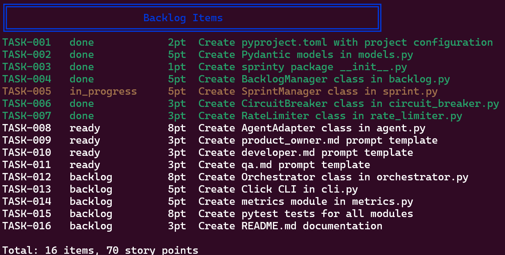
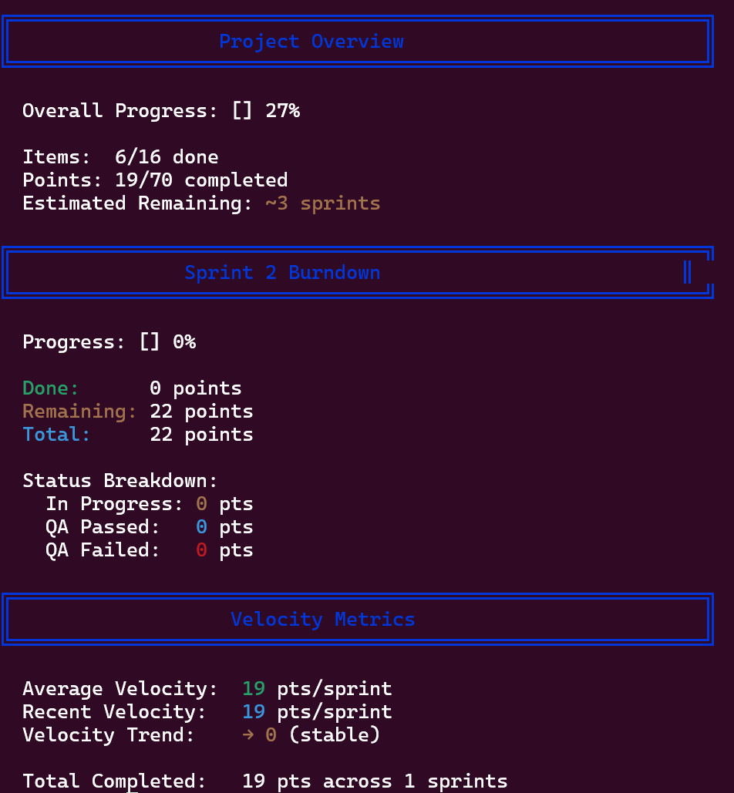
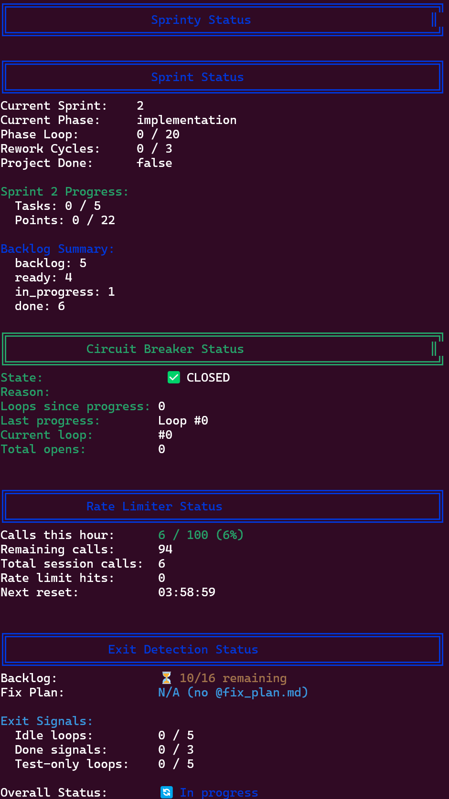

<div align="center">

# 🚀 Sprinty


### Sprint-based Software Development Orchestrator for AI Agents

**Transform your product requirements into working software—automatically.**

Sprinty orchestrates AI agents to execute the complete software development lifecycle, from requirements to delivery, using structured agile sprint cycles.

[Quick Start](#-quick-start) • [Features](#-features) • [Documentation](#-cli-commands) • [Examples](#-examples)

</div>

---

## 🎯 What is Sprinty?

Sprinty is an **autonomous agile development system** that manages multi-agent collaboration through sprint-based workflows. It automates the entire development process by coordinating three specialized AI agents:

### The Workflow

```
┌──────────────────────────────────────────────────────────────┐
│  Sprint 0: Initialization                                     │
│  └─ Product Owner parses PRD & creates prioritized backlog   │
└──────────────────────────────────────────────────────────────┘
                          ↓
┌──────────────────────────────────────────────────────────────┐
│  Sprint 1-N: Iterative Development                            │
│                                                                │
│  📋 Planning    → PO selects tasks for sprint                │
│  💻 Development → Developer implements with tests             │
│  🧪 QA          → QA verifies acceptance criteria             │
│  ✅ Review      → PO accepts/rejects work                     │
│                                                                │
│  Loop continues until all tasks done or max sprints reached  │
└──────────────────────────────────────────────────────────────┘
```

### Live Dashboard Views

<table>
<tr>
<td width="33%">

**Backlog Management**


</td>
<td width="33%">

**Metrics & Analytics**


</td>
<td width="33%">

**Real-time Status**


</td>
</tr>
</table>

## ✨ Features

<table>
<tr>
<td width="50%">

### 🤖 **Multi-Agent Orchestration**
Three specialized AI agents work together:
- **Product Owner** - Plans sprints, reviews work
- **Developer** - Implements features with tests
- **QA** - Verifies acceptance criteria

### 📋 **Intelligent Backlog Management**
- Automatic task breakdown from PRD
- Priority-based task selection
- Real-time status tracking
- Story point estimation

### 🔄 **Agile Sprint Workflow**
- Sprint planning & capacity management
- Implementation with automated testing
- QA verification with rework cycles
- Sprint review & retrospectives

</td>
<td width="50%">

### 📊 **Real-time Metrics & Monitoring**
- Live burndown charts
- Velocity tracking & predictions
- Health score monitoring
- Interactive dashboard (tmux)

### 🛡️ **Built-in Safety Mechanisms**
- **Circuit Breaker** - Prevents infinite loops
- **Rate Limiter** - API call management (100/hour)
- **Container Sandbox** - Isolated execution
- **Progress Detection** - Auto-completion

### ⚡ **Performance & Reliability**
- Cached container builds (instant startup)
- Atomic JSON operations
- Graceful error handling
- Comprehensive logging

</td>
</tr>
</table>

## 🚀 Quick Start

### Prerequisites

<table>
<tr>
<td width="25%">

**Bash**
```bash
bash --version
# >= 4.0
```

</td>
<td width="25%">

**jq**
```bash
sudo apt install jq
# JSON processor
```

</td>
<td width="25%">

**AI Agent CLI**
```bash
# Option 1: OpenCode (Recommended, Free)
curl -fsSL https://opencode.ai/install | bash

# Option 2: Cursor Agent
curl https://cursor.com/install -fsS | bash
```

</td>
<td width="25%">

**Apptainer** *(optional)*
```bash
sudo apt install apptainer
# Recommended!
```

</td>
</tr>
</table>

> 💡 **Note:** Sprinty supports multiple AI agent backends. By default, it uses **OpenCode** with the free `opencode/minimax-m2.1-free` model. You can switch to cursor-agent by modifying the configuration.

### Installation

```bash
# Clone the repository
git clone https://github.com/your-username/sprinty.git
cd sprinty

# Run the installer
./install.sh

# Or install manually
chmod +x sprinty.sh
ln -s "$(pwd)/sprinty.sh" /usr/local/bin/sprinty
```

### Your First Sprint in 3 Steps

```bash
# 1️⃣  Navigate to your project directory
cd /path/to/your/project

# 2️⃣  Initialize with your PRD
sprinty init my-awesome-app --prd docs/requirements.md

# 3️⃣  Run in container sandbox with live monitoring
sprinty --container --workspace . --monitor run
```

**That's it!** Sprinty will now:
- ✅ Parse your PRD and create a backlog
- ✅ Plan sprints automatically
- ✅ Implement features with tests
- ✅ Run QA verification
- ✅ Show real-time progress in the dashboard

### 🎬 Watch It Work

The `--monitor` flag launches a split-screen tmux dashboard:

```
╔══════════════════════════════════════╗
║  Top: Real-time Status & Metrics     ║  ← Live updates every 5s
╠══════════════════════════════════════╣
║  Bottom: Agent Activity & Logs       ║  ← See AI agents working
╚══════════════════════════════════════╝
```

Press `Ctrl+B` then `D` to detach, `tmux attach` to reattach anytime!

---

## 💡 Why Container Mode?

<div align="center">

### 🛡️ **Safe** • 🔧 **Flexible** • 🗑️ **Clean**

</div>

Running with `--container --workspace .` is **strongly recommended**:

| Benefit | Without Container | With Container |
|---------|------------------|----------------|
| **Host Protection** | ❌ Agents can modify anything | ✅ Isolated sandbox |
| **Package Installation** | ❌ Requires manual setup | ✅ Agents install as needed |
| **File Operations** | ⚠️ Risky deletions | ✅ Safe in container |
| **Cleanup** | 🧹 Manual | ✅ Auto-reset on restart |
| **Project Files** | ✅ Accessible | ✅ Mounted at `/workspace` |

```bash
# First run: builds cached container (2-3 min, one-time)
sprinty --container --workspace . run
# → "Building cached container (one-time setup)..."

# Subsequent runs: instant startup!
sprinty --container --workspace . run
# → "Using cached container: ~/.local/share/sprinty/containers/ubuntu_24.04.sif"
```

> 💡 **Tip:** Pre-build the cache to avoid waiting: `sprinty container build`

---

## 🎯 Examples

### Example 1: Build a Todo App

```bash
# Create PRD
cat > PRD.md << 'EOF'
# Todo Application
Build a CLI todo app with:
- Add/remove/list tasks
- Mark tasks complete
- Save to JSON file
- Unit tests required
EOF

# Initialize & run
sprinty init todo-app --prd PRD.md
sprinty --container --workspace . --monitor run

# Check progress
sprinty status
sprinty backlog list
```

### Example 2: Python Project with Custom Container

```bash
# Use Python 3.12 container
sprinty init ml-project --prd requirements.md
sprinty --container python:3.12 --workspace . --monitor run
```

### Example 3: Monitor Existing Sprint

```bash
# Check detailed status
sprinty status

# View metrics & burndown
sprinty metrics

# List all backlog items
sprinty backlog list

# Add new task mid-sprint
sprinty backlog add "Fix critical bug" --type bug --priority 1 --points 2
```

---

## 📖 CLI Commands

### 📋 Project Initialization

```bash
# Navigate to your project directory first
cd /path/to/your/project

# Initialize with PRD
sprinty init <project-name> --prd <prd-file>

# Example
sprinty init shopping-cart --prd specs/PRD.md
```

### 🚀 Sprint Execution

<table>
<tr>
<td width="60%">

#### Recommended: Container + Monitor

```bash
# Full-featured execution
sprinty --container --workspace . --monitor run
```

**What happens:**
- 🐳 Launches isolated Apptainer container
- 📂 Mounts your project at `/workspace`
- 📊 Opens live tmux dashboard
- 🤖 Runs autonomous agent loop

</td>
<td width="40%">

#### Quick Commands

```bash
# Check status anytime
sprinty status

# Exit code 20 if done
sprinty status --check-done

# View metrics
sprinty metrics
```

</td>
</tr>
</table>

#### Advanced Container Options

```bash
# Custom Ubuntu version
sprinty --container ubuntu:22.04 --workspace . run

# Python environment
sprinty --container python:3.12 --workspace ~/project --monitor run

# Node.js environment
sprinty --container node:20 --workspace . run

# Without container (⚠️ use with caution)
sprinty --monitor run
```

**Flag Reference:**

| Flag | Description |
|------|-------------|
| `--container [image]` | Run in Apptainer sandbox (default: `ubuntu:24.04`) |
| `--workspace <path>` | Mount this directory as `/workspace` in container |
| `--monitor` or `-m` | Launch real-time tmux dashboard |

### 🐳 Container Mode

Running Sprinty in a container sandbox provides isolation and safety:

<table>
<tr>
<td>

#### Benefits

- 🛡️ **Host system protected** from destructive operations
- 🔧 **Auto-install packages** (apt, pip, npm) as needed
- 🗑️ **Safe file operations** - agents can delete/modify freely
- 🔄 **Clean reset** - container resets on restart
- 📂 **Project persists** - only `/workspace` is preserved

</td>
<td>

#### Requirements

**Apptainer** (formerly Singularity)

```bash
# Ubuntu/Debian
sudo apt install apptainer

# Fedora/RHEL
sudo dnf install apptainer

# Arch Linux
yay -S apptainer
```

</td>
</tr>
</table>

### ⚡ Container Caching

The first container run builds a cached image with pre-installed packages. Subsequent runs start **instantly**!

#### How It Works

```bash
# First run: builds cache (2-3 minutes, one-time only)
$ sprinty --container --workspace . run
→ Building cached container (one-time setup)...
→ Installing: curl, git, jq, python3, pip, build-essential...
→ Cache saved: ~/.local/share/sprinty/containers/ubuntu_24.04.sif

# Subsequent runs: instant startup!
$ sprinty --container --workspace . run
→ Using cached container: ubuntu_24.04.sif
→ Starting sprint...
```

#### Cache Management Commands

```bash
# Pre-build cache (skip waiting on first run)
sprinty container build                 # Default: ubuntu:24.04
sprinty container build python:3.12     # Python environment
sprinty container build node:20         # Node.js environment

# List all cached containers
sprinty container list
# Output:
#   Cached containers in: ~/.local/share/sprinty/containers
#   • ubuntu_24.04.sif (450M) - 2026-01-06 12:00:00
#   • python_3.12.sif (520M) - 2026-01-06 12:05:00
#   Total: 2 container(s)

# Clear cache (rebuild with updates)
sprinty container clear
```

#### Pre-installed in Cached Containers

- **System:** curl, git, jq, tmux
- **Python:** python3, pip, venv
- **Build tools:** build-essential, gcc, make
- **Locale:** en_US.UTF-8 (proper Unicode support)

> 📍 **Cache location:** `~/.local/share/sprinty/containers/`

### 📋 Backlog Management

Manage your project backlog with full CRUD operations:

```bash
# List all items (shows in terminal dashboard)
sprinty backlog list

# Add new item
sprinty backlog add "Implement user authentication" \
  --type feature \
  --priority 1 \
  --points 8

# Show summary statistics
sprinty backlog summary
```

**Available Options:**

| Option | Values | Default | Description |
|--------|--------|---------|-------------|
| `--type` | `feature`, `bug`, `spike`, `infra`, `chore` | `feature` | Type of work |
| `--priority` | `1-5` | `1` | Lower = higher priority |
| `--points` | Story points | `3` | Effort estimation |

**Task Types Explained:**

- **feature** - New functionality
- **bug** - Defect fix
- **spike** - Research/investigation
- **infra** - Infrastructure/tooling
- **chore** - Maintenance work

### 📊 Metrics & Monitoring

Track your project's progress with comprehensive metrics:

```bash
# Full metrics dashboard
sprinty metrics
```

**What You'll See:**

<table>
<tr>
<td width="50%">

#### Project Overview
- Overall progress percentage
- Items done vs. total
- Story points completed
- Estimated sprints remaining

#### Sprint Burndown
- Current sprint progress bar
- Points done/remaining/total
- Status breakdown (in progress, QA passed/failed)

</td>
<td width="50%">

#### Velocity Metrics
- Average velocity (pts/sprint)
- Recent velocity trend
- Velocity trend direction
- Total completed across all sprints

#### Health Indicators
- Circuit breaker status
- Rate limiter usage
- Exit detection signals
- Overall project health

</td>
</tr>
</table>

**Example Output:**


### 🐳 Container Cache Management

```bash
# Build cached container (speeds up first run)
sprinty container build                 # Default: ubuntu:24.04
sprinty container build python:3.12     # Python environment
sprinty container build node:20         # Node.js environment

# List all cached containers with sizes and dates
sprinty container list

# Clear all cached containers (free disk space)
sprinty container clear
```

### 🔧 Troubleshooting

```bash
# Reset circuit breaker (if halted unexpectedly)
sprinty --reset-circuit

# Reset rate limiter (if hitting API limits)
sprinty --reset-rate-limit

# Rebuild container cache (if corrupt or outdated)
sprinty container clear
sprinty container build

# Show help and all available commands
sprinty --help

# Show version information
sprinty --version
```

**Common Issues:**

| Problem | Solution |
|---------|----------|
| Circuit breaker halted | `sprinty --reset-circuit` |
| Rate limit reached | Wait for reset or `sprinty --reset-rate-limit` |
| Container won't start | `sprinty container clear && sprinty container build` |
| Agent stuck in loop | Check logs in `logs/agent_output/` |
| Stale backlog | Manually edit `backlog.json` |

---

## 📁 Project Structure

After initialization, Sprinty creates this structure in your project:

```
my-project/
├── .sprinty/                    # ⚙️  Sprinty state (auto-created)
│   ├── config.json              #     Project configuration
│   ├── sprint_state.json        #     Current sprint state
│   └── status.json              #     Execution status
│
├── backlog.json                 # 📋 Product backlog
│
├── sprints/                     # 📝 Sprint plans (auto-created)
│   ├── sprint_1_plan.md
│   ├── sprint_2_plan.md
│   └── ...
│
├── reviews/                     # ✅ Sprint reviews (auto-created)
│   ├── sprint_1_review.md
│   ├── sprint_2_review.md
│   └── ...
│
├── logs/                        # 📊 Execution logs
│   └── agent_output/
│       ├── product_owner.log
│       ├── developer.log
│       └── qa.log
│
├── specs/                       # 📖 Your documentation
│   └── PRD.md                   #     Product requirements
│
└── src/                         # 💻 Your source code (created by agents)
    └── ...
```

**What Gets Created:**

| Directory/File | Created By | Purpose |
|----------------|------------|---------|
| `.sprinty/` | `sprinty init` | Stores sprint state and configuration |
| `backlog.json` | Product Owner | Prioritized list of tasks |
| `sprints/` | Product Owner | Sprint plans for each iteration |
| `reviews/` | Product Owner | Sprint review outcomes |
| `logs/` | Sprinty | Agent output and debugging info |
| `src/` | Developer Agent | Your actual application code |

---

## 📊 Data Schemas

### backlog.json Structure

```json
{
  "project": "my-project",
  "items": [
    {
      "id": "TASK-001",
      "title": "Implement feature X",
      "type": "feature",
      "priority": 1,
      "story_points": 5,
      "status": "backlog",
      "sprint_id": null,
      "acceptance_criteria": [
        "Feature can be enabled via config",
        "All edge cases handled",
        "Unit tests achieve 90% coverage"
      ],
      "dependencies": [],
      "created_at": "2026-01-06T10:00:00Z",
      "updated_at": "2026-01-06T10:00:00Z"
    }
  ],
  "metadata": {
    "total_items": 1,
    "total_points": 5
  }
}
```

### Task Status Flow Diagram

```
                   ┌─────────────────────────────────────┐
                   │         BACKLOG                      │
                   │   (Waiting to be selected)          │
                   └──────────────┬──────────────────────┘
                                  │
                         Sprint Planning
                                  │
                                  ↓
                   ┌──────────────────────────────────────┐
                   │          READY                       │
                   │   (Selected for current sprint)     │
                   └──────────────┬──────────────────────┘
                                  │
                          Developer starts
                                  │
                                  ↓
                   ┌──────────────────────────────────────┐
                   │       IN_PROGRESS                    │
                   │   (Developer implementing)          │
                   └──────────────┬──────────────────────┘
                                  │
                        Implementation complete
                                  │
                                  ↓
                   ┌──────────────────────────────────────┐
                   │      IMPLEMENTED                     │
                   │   (Ready for QA)                    │
                   └──────────────┬──────────────────────┘
                                  │
                             QA starts
                                  │
                                  ↓
                   ┌──────────────────────────────────────┐
                   │     QA_IN_PROGRESS                   │
                   │   (QA verifying)                    │
                   └──────────────┬──────────────────────┘
                                  │
                      ┌───────────┴───────────┐
                      │                       │
                 QA Passed                QA Failed
                      │                       │
                      ↓                       ↓
         ┌────────────────────┐   ┌────────────────────┐
         │    QA_PASSED        │   │    QA_FAILED       │
         │ (Ready for review) │   │  (Needs rework)    │
         └─────────┬───────────┘   └──────────┬─────────┘
                   │                           │
            PO Accepts                   ↓ Rework Cycle
                   │                     (max 3 cycles)
                   ↓                           │
         ┌────────────────────┐               │
         │       DONE          │               │
         │   (Completed!)     │               │
         └────────────────────┘               │
                                               │
                   ↑───────────────────────────┘
                      (Back to IN_PROGRESS)
```

**Status Descriptions:**

| Status | Description | Next State |
|--------|-------------|------------|
| `backlog` | Waiting to be selected | → `ready` |
| `ready` | Selected for sprint | → `in_progress` |
| `in_progress` | Developer working | → `implemented` |
| `implemented` | Code done, needs QA | → `qa_in_progress` |
| `qa_in_progress` | QA testing | → `qa_passed` or `qa_failed` |
| `qa_passed` | QA approved | → `done` |
| `qa_failed` | QA rejected | → `in_progress` (rework) |
| `done` | Completed & accepted | Final state |

---

## ⚙️ Configuration

### Project Configuration (.sprinty/config.json)

```json
{
  "project": {
    "name": "my-project"
  },
  "agent": {
    "cli_tool": "opencode",                // Agent backend: "opencode" or "cursor-agent"
    "model": "opencode/minimax-m2.1-free",      // Model to use
    "timeout_minutes": 15,                  // Timeout for agent execution
    "output_format": "text"                 // Output format
  },
  "sprint": {
    "max_sprints": 10,                      // Maximum number of sprints
    "default_capacity": 20,                 // Default story points per sprint
    "planning_max_loops": 3,                // Max iterations in planning phase
    "implementation_max_loops": 20,         // Max iterations in dev phase
    "qa_max_loops": 5,                      // Max iterations in QA phase
    "review_max_loops": 2,                  // Max iterations in review phase
    "max_rework_cycles": 3                  // Max QA failure rework cycles
  },
  "rate_limiting": {
    "max_calls_per_hour": 100,              // API rate limit
    "min_wait_between_calls_sec": 5         // Minimum wait between calls
  },
  "circuit_breaker": {
    "max_consecutive_failures": 3,          // Halt after N failures
    "max_consecutive_no_progress": 5        // Halt if stuck for N loops
  }
}
```

### Choosing Your AI Agent Backend

Sprinty supports multiple AI agent CLI tools. During initialization, Sprinty creates config templates for easy switching:

```bash
sprinty init my-project --prd requirements.txt
```

This creates:
- `.sprinty/config.json` (active config, default: OpenCode)
- `.sprinty/config.cursor_agent.json` (Cursor-Agent template)
- `.sprinty/config.opencode.json` (OpenCode template)

#### Quick Switch Between Agents

**Switch to Cursor-Agent (Recommended for Production):**
```bash
cp .sprinty/config.cursor_agent.json .sprinty/config.json
```

**Switch to OpenCode (Free tier):**
```bash
cp .sprinty/config.opencode.json .sprinty/config.json
```

**Temporary Override:**
```bash
export SPRINTY_AGENT_CLI=cursor-agent
sprinty run
```

#### Option 1: OpenCode (Default, Free)

```json
{
  "agent": {
    "cli_tool": "opencode",
    "model": "opencode/minimax-m2.1-free"
  }
}
```

**Installation:**
```bash
curl -fsSL https://opencode.ai/install | bash
source ~/.bashrc
```

**Available Models:**
- `opencode/minimax-m2.1-free` - Free, no API key required
- `opencode/glm-4.7-free` - Alternative free model
- `opencode/gpt-4o-mini` - Paid, more reliable
- See [OpenCode documentation](https://opencode.ai/docs) for more models

**Note:** Free model may be less stable than paid options.

#### Option 2: Cursor Agent (Recommended for Production)

```json
{
  "agent": {
    "cli_tool": "cursor-agent",
    "model": "opus-4.5-thinking"
  }
}
```

**Installation:**
```bash
curl https://cursor.com/install -fsS | bash
```

**Available Models:**
- `opus-4.5-thinking` - Default, most capable with extended thinking
- `opus-4.5` - Claude Opus without thinking
- `sonnet-4.5-thinking` - Claude Sonnet with thinking (faster)
- `sonnet-4.5` - Claude Sonnet (fastest)

#### Comparison

| Feature | OpenCode | Cursor Agent |
|---------|----------|--------------|
| **Cost** | ✅ Free tier available | 💰 Requires Cursor subscription |
| **Setup** | Easy (curl install) | Easy (curl install) |
| **Default Model** | `opencode/minimax-m2.1-free` | `opus-4.5-thinking` |
| **Stability** | ⚠️ May crash (Bun runtime) | ✅ Very stable |
| **Instruction Following** | ⚠️ Variable (free model) | ✅ Excellent |
| **Best For** | Testing, experimentation | Production, important projects |

**Recommendation:** Use Cursor-Agent for production workloads. The free OpenCode model is good for experimentation but may crash or not follow instructions consistently.
```

### Environment Variables

Customize Sprinty's behavior with these environment variables:

```bash
# Set AI agent backend (default: opencode)
export AGENT_CLI_TOOL=opencode  # or cursor-agent

# Set agent model (optional, overrides config)
export AGENT_MODEL="opencode/minimax-m2.1-free"

# Set rate limit (default: 100)
export MAX_CALLS_PER_HOUR=200

# Change state directory (default: .sprinty)
export SPRINTY_DIR=".sprinty-custom"

# Change backlog file location (default: backlog.json)
export BACKLOG_FILE="custom_backlog.json"

# Run with custom settings
sprinty --container --workspace . run
```

| Variable | Default | Description |
|----------|---------|-------------|
| `AGENT_CLI_TOOL` | `opencode` | Agent backend (`opencode` or `cursor-agent`) |
| `AGENT_MODEL` | (from config) | AI model to use |
| `AGENT_TIMEOUT_MINUTES` | `15` | Timeout for agent execution |
| `MAX_CALLS_PER_HOUR` | `100` | API rate limit for agent calls |
| `SPRINTY_DIR` | `.sprinty` | Directory for state files |
| `BACKLOG_FILE` | `backlog.json` | Backlog file location |
| `OPENCODE_API_KEY` | - | API key for opencode (if using paid models) |
| `CURSOR_API_KEY` | - | API key for cursor-agent |

---

## 🚦 Exit Codes

Sprinty uses specific exit codes to indicate different completion states:

```bash
# Check exit code after run
sprinty run
echo $?
```

| Code | Name | Description | Action |
|------|------|-------------|--------|
| `0` | **Success** | Normal completion | ✅ All good |
| `1` | **Error** | General error occurred | 🔍 Check logs |
| `10` | **Circuit Breaker** | Halted due to no progress | 🔧 Review sprint state, reset circuit |
| `20` | **Project Done** | All tasks completed! | 🎉 Celebrate! |
| `21` | **Max Sprints** | Reached sprint limit | 📈 Increase `max_sprints` if needed |

**Example Usage:**

```bash
# Script that handles different exit codes
sprinty --container --workspace . run
EXIT_CODE=$?

case $EXIT_CODE in
  0)
    echo "Sprint completed successfully"
    ;;
  10)
    echo "Circuit breaker triggered - checking logs..."
    sprinty status
    ;;
  20)
    echo "Project complete! 🎉"
    sprinty metrics
    ;;
  21)
    echo "Max sprints reached - project may need more time"
    ;;
  *)
    echo "Error occurred - check logs/agent_output/"
    ;;
esac
```

---

## 🤖 Agent Prompts & Status Protocol

Sprinty uses role-specific prompts located in the `prompts/` directory:

### Agent Roles

| Agent | File | Responsibilities |
|-------|------|------------------|
| **Product Owner** | `prompts/product_owner.md` | Parse PRD, create backlog, plan sprints, review work |
| **Developer** | `prompts/developer.md` | Implement features, write tests, follow best practices |
| **QA** | `prompts/qa.md` | Verify acceptance criteria, test functionality |

### Status Block Protocol

Each agent must output a structured status block for Sprinty to parse:

```
---SPRINTY_STATUS---
ROLE: developer
PHASE: implementation
SPRINT: 1
TASKS_COMPLETED: 1
TASKS_REMAINING: 2
BLOCKERS: none
STORY_POINTS_DONE: 5
TESTS_STATUS: PASSING
PHASE_COMPLETE: false
PROJECT_DONE: false
NEXT_ACTION: Continue with TASK-002
---END_SPRINTY_STATUS---
```

**Status Block Fields:**

| Field | Description | Example Values |
|-------|-------------|----------------|
| `ROLE` | Agent role | `product_owner`, `developer`, `qa` |
| `PHASE` | Current phase | `planning`, `implementation`, `qa`, `review` |
| `SPRINT` | Sprint number | `1`, `2`, `3` |
| `TASKS_COMPLETED` | Tasks done this sprint | `3` |
| `TASKS_REMAINING` | Tasks left in sprint | `2` |
| `BLOCKERS` | Current blockers | `none`, `dependency on TASK-005` |
| `STORY_POINTS_DONE` | Points completed | `15` |
| `TESTS_STATUS` | Test status | `PASSING`, `FAILING`, `N/A` |
| `PHASE_COMPLETE` | Phase done? | `true`, `false` |
| `PROJECT_DONE` | Project complete? | `true`, `false` |
| `NEXT_ACTION` | What's next | Description of next step |

This protocol allows Sprinty to track progress and orchestrate the workflow automatically.

---

## 🧪 Testing

Sprinty includes comprehensive test suites using [bats](https://github.com/bats-core/bats-core).

### Running Tests

```bash
# Install bats (if not already installed)
npm install -g bats

# Run all unit tests
bats tests/unit/

# Run specific test file
bats tests/unit/test_backlog_manager.bats

# Run all integration tests
bats tests/integration/

# Run specific integration test
bats tests/integration/test_full_workflow.bats
```

### Test Structure

```
tests/
├── helpers/
│   └── test_helper.bash           # Shared test utilities
│
├── unit/                           # Unit tests
│   ├── test_backlog_manager.bats  # Backlog CRUD operations
│   ├── test_sprint_manager.bats   # Sprint state management
│   ├── test_circuit_breaker.bats  # Circuit breaker logic
│   ├── test_rate_limiter.bats     # Rate limiting
│   ├── test_done_detector.bats    # Completion detection
│   ├── test_metrics_collector.bats # Metrics calculations
│   └── ...
│
└── integration/                    # Integration tests
    ├── test_full_workflow.bats     # End-to-end workflow
    ├── test_sprint_lifecycle.bats  # Complete sprint cycle
    ├── test_qa_workflow.bats       # QA with rework cycles
    └── ...
```

### Manual Testing

```bash
# Source modules for interactive testing
source lib/utils.sh
source lib/backlog_manager.sh

# Test backlog operations
init_backlog "test-project"
add_backlog_item "Test task" "feature" 1 3
list_backlog
backlog_summary

# Test sprint manager
source lib/sprint_manager.sh
init_sprint_state
start_sprint 1
```

---

## 📚 Module Reference

Sprinty is built with a modular architecture. Each module is self-contained and testable:

| Module | Description | Key Functions |
|--------|-------------|---------------|
| **`lib/utils.sh`** | Core utilities | `log_info`, `log_error`, `get_timestamp`, `json_get`, `json_set` |
| **`lib/backlog_manager.sh`** | Backlog CRUD | `init_backlog`, `add_backlog_item`, `list_backlog`, `update_backlog_item_status` |
| **`lib/sprint_manager.sh`** | Sprint state | `init_sprint_state`, `start_sprint`, `end_sprint`, `get_current_phase` |
| **`lib/agent_adapter.sh`** | cursor-agent integration | `call_agent`, `parse_agent_output`, `extract_status_block` |
| **`lib/circuit_breaker.sh`** | Loop prevention | `check_circuit_breaker`, `record_progress`, `reset_circuit_breaker` |
| **`lib/rate_limiter.sh`** | API rate control | `check_rate_limit`, `record_api_call`, `get_wait_time` |
| **`lib/done_detector.sh`** | Completion detection | `check_project_done`, `check_sprint_done`, `should_exit` |
| **`lib/metrics_collector.sh`** | Analytics | `calculate_burndown`, `get_velocity`, `generate_metrics_report` |
| **`lib/container.sh`** | Container management | `build_container_cache`, `run_in_container`, `list_containers` |

### Module Dependencies

```
sprinty.sh (main)
    │
    ├─→ utils.sh (always loaded first)
    │
    ├─→ backlog_manager.sh
    │       └─→ utils.sh
    │
    ├─→ sprint_manager.sh
    │       └─→ utils.sh
    │
    ├─→ agent_adapter.sh
    │       ├─→ utils.sh
    │       └─→ rate_limiter.sh
    │
    ├─→ circuit_breaker.sh
    │       └─→ utils.sh
    │
    ├─→ done_detector.sh
    │       ├─→ utils.sh
    │       └─→ backlog_manager.sh
    │
    ├─→ metrics_collector.sh
    │       ├─→ utils.sh
    │       ├─→ backlog_manager.sh
    │       └─→ sprint_manager.sh
    │
    └─→ container.sh
            └─→ utils.sh
```

---

## 🔧 Development

### Adding New Features

Follow these steps to extend Sprinty:

1. **Create/modify module** in `lib/`
   ```bash
   # Create new module
   touch lib/my_feature.sh
   ```

2. **Implement functionality**
   ```bash
   #!/usr/bin/env bash
   
   # Source dependencies
   source "$(dirname "${BASH_SOURCE[0]}")/utils.sh"
   
   # Export your functions
   my_feature_function() {
       log_info "Doing something..."
   }
   export -f my_feature_function
   ```

3. **Source in `sprinty.sh`**
   ```bash
   # Add to sprinty.sh
   source "${LIB_DIR}/my_feature.sh"
   ```

4. **Add tests** in `tests/unit/`
   ```bash
   # tests/unit/test_my_feature.bats
   @test "my_feature_function works" {
       run my_feature_function
       [ "$status" -eq 0 ]
   }
   ```

5. **Update documentation**
   - Add to this README
   - Update inline comments
   - Add usage examples

### Development Best Practices

#### Bash Conventions

```bash
# ✅ DO: Use jq for JSON operations
result=$(jq -r '.items[] | select(.id == "TASK-001")' backlog.json)

# ❌ DON'T: Use grep/sed for JSON
result=$(grep -A 5 "TASK-001" backlog.json)

# ✅ DO: Atomic writes with temp files
jq '.metadata.updated = true' backlog.json > backlog.json.tmp
mv backlog.json.tmp backlog.json

# ❌ DON'T: Direct overwrites
jq '.metadata.updated = true' backlog.json > backlog.json

# ✅ DO: Export functions that need to be accessible
export -f my_function

# ✅ DO: Source utils.sh first in every module
source "$(dirname "${BASH_SOURCE[0]}")/utils.sh"

# ✅ DO: Use consistent logging
log_info "Processing task..."
log_error "Failed to process task"
log_success "Task completed"
```

#### Code Style

- Use 2 spaces for indentation
- Quote all variable expansions: `"${var}"`
- Use `[[  ]]` for conditionals, not `[  ]`
- Prefix local variables with `local`
- Use descriptive function names: `verb_noun` pattern

#### Testing

```bash
# Always test with bats before committing
bats tests/unit/

# Test individual modules
source lib/my_feature.sh
my_feature_function "test-input"

# Test with different scenarios
export SPRINTY_DIR=".test-sprinty"
sprinty init test --prd test.md
```

---

## 🤝 Contributing

We welcome contributions! Here's how to get started:

### Quick Start

1. **Fork the repository**
   ```bash
   # Fork on GitHub, then clone your fork
   git clone https://github.com/YOUR_USERNAME/sprinty.git
   cd sprinty
   ```

2. **Create a feature branch**
   ```bash
   git checkout -b feature/amazing-feature
   ```

3. **Make your changes**
   - Add features or fix bugs
   - Follow the [development best practices](#development)
   - Add tests for new functionality
   - Update documentation

4. **Test your changes**
   ```bash
   # Run all tests
   bats tests/unit/
   bats tests/integration/
   
   # Manual testing
   ./sprinty.sh init test-project --prd examples/test.md
   ./sprinty.sh --monitor run
   ```

5. **Commit with clear messages**
   ```bash
   git commit -m 'feat: Add amazing feature'
   ```
   
   Use conventional commits:
   - `feat:` - New feature
   - `fix:` - Bug fix
   - `docs:` - Documentation only
   - `test:` - Adding/updating tests
   - `refactor:` - Code refactoring
   - `chore:` - Maintenance tasks

6. **Push to your fork**
   ```bash
   git push origin feature/amazing-feature
   ```

7. **Open a Pull Request**
   - Go to the original repository
   - Click "New Pull Request"
   - Describe your changes
   - Link any related issues

### What to Contribute

- 🐛 **Bug fixes** - Found an issue? Fix it!
- ✨ **New features** - Add new capabilities
- 📚 **Documentation** - Improve guides and examples
- 🧪 **Tests** - Increase test coverage
- 🎨 **UI/UX** - Improve dashboard and output formatting
- 🔧 **Performance** - Optimize slow operations
- 🌐 **Examples** - Add example PRDs and use cases

### Code Review Process

1. Automated checks run on all PRs
2. Maintainers review code within 2-3 days
3. Address any feedback
4. Once approved, maintainer will merge

### Questions?

- 💬 Open an [issue](https://github.com/your-username/sprinty/issues)
- 📧 Contact maintainers
- 📖 Check existing [discussions](https://github.com/your-username/sprinty/discussions)

---

## 📄 License

MIT License - See [LICENSE](LICENSE) for details.

---

## 🙏 Acknowledgments

- **Inspired by** [Ralph](https://ghuntley.com/ralph/) - Geoffrey Huntley's autonomous development technique
- **Reference implementation** from [ralph-cursor-agent](../ralph-cursor-agent)
- **Built for** [Cursor](https://cursor.com) Agent CLI by Anthropic
- **Community** - Thanks to all contributors and early adopters!

---

## 🚀 Ready to Start?

<div align="center">

### Get started in 3 commands:

```bash
git clone https://github.com/your-username/sprinty.git && cd sprinty
./install.sh
sprinty init my-project --prd requirements.md && sprinty --container --workspace . --monitor run
```

### 📚 Learn More

[📖 Documentation](docs/) • [💡 Examples](examples/) • [🐛 Issues](https://github.com/your-username/sprinty/issues) • [💬 Discussions](https://github.com/your-username/sprinty/discussions)

---

**Made with ❤️ for autonomous development**

*Let Sprinty handle the sprints, you handle the vision.*

</div>
